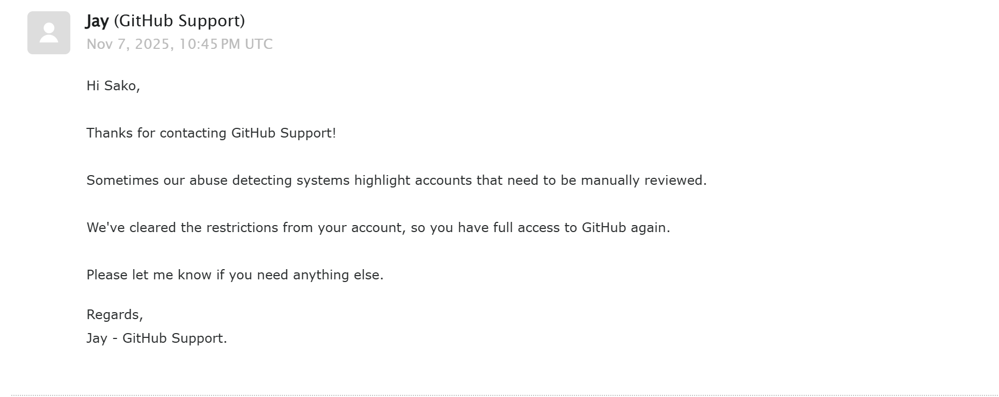

# Hi there, I'm sakocat! 👋

🎓 **Student | Cloud Computing Enthusiast**

---

## 🌐 About Me

- 👩 Pronouns: She/her
- 🍥 含糖（易性症，女）但是我永远是男的
- 💻 Tech Stack: Python | SQL | PHP
- ☁️ Focus: Cloud Computing
- 📨 Contact: biz-talk@corp.sko.pm

## 🚀 Skills & Interests
- Python scripting for automation & data analysis
- SQL for database management
- PHP for web development & backend
- Cloud platforms & virtualization

## 📊 GitHub Profile Views

## 💡 Fun Fact
喜欢探索新技术，也喜欢用代码让世界变得更有趣！

---

我是废物

Thanks for stopping by! 欢迎通过邮箱联系我，或在 GitHub 留言～

> Hi Sako,  
>  
> Thanks for contacting GitHub Support!  
>  
> Sometimes our abuse detecting systems highlight accounts that need to be manually reviewed.  
>  
> We've cleared the restrictions from your account, so you have full access to GitHub again.  
>  
> Please let me know if you need anything else.  
>  
> Regards,  
> Jay - GitHub Support.

---

### 😤 我的账号终于解封了，但我真的很气！

我只是正常使用 GitHub，结果却莫名其妙被系统标记为“需要人工审核”，导致账号被限制访问。这段时间我无法提交代码、无法参与项目协作，甚至别人连查看自己的仓库都做不到

GitHub 的自动检测系统太不透明了，连个明确的理由都不给。虽然现在解封了，但这段经历让我对平台的信任大打折扣。

> **我不是机器人，我是开发者。请尊重我们的时间和努力。**

AI真好用
